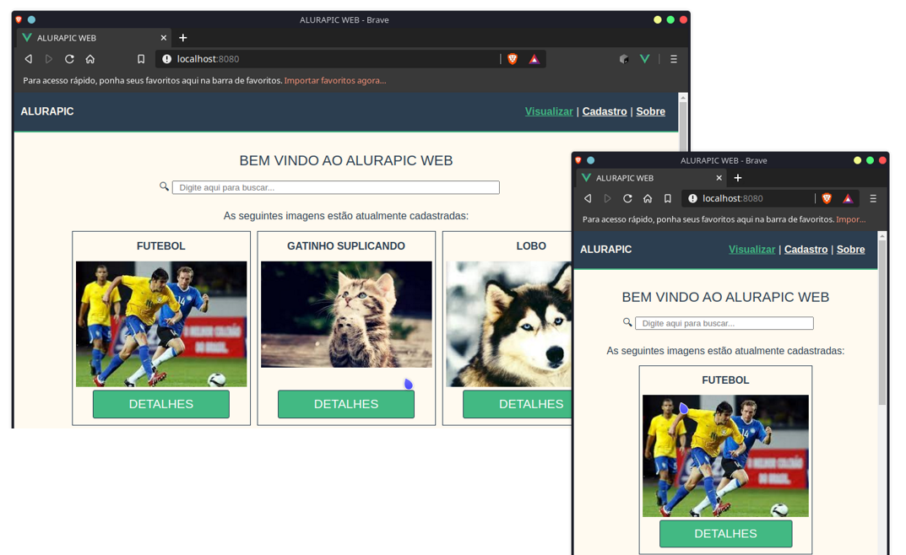

# ALURAPIC

<p align="center">
  
</p>

**ALURAPIC** é uma SPA desenvolvida em Vue.js como projeto de curso na [Alura](https://alura.com.br/).


## :rocket: Tech Stack

- Vue.js
- Vuex
- Vue Router
- Vue Resource

## 💻 Sobre o projeto

Este projeto é resultado dos dois cursos sobre o framework que estavam disponíveis quando comecei a brincar com esta tecnologia. Além de outros cursos, como VueMastery, este projeto foi uma refatoração do zero do alurapic original, incluindo muitas outras coisas e removendo o que eu achava que não ficaria legal.

É um frontend mega simples que comunica com uma API REST feita em NodeJS e usa um database Mock JSON.

O código base deste projeto foi desenvolvido seguindo a formação de Vue. Além de outros cursos na Alura, como: 

- ✓ HTML/CSS
- ✓ JavaScript
- ✓ Flexbox
- ✓ REST

## :wrench: ToDo

Este projeto já está finalizado! :trophy: 

<br/>

___

<br/>

## Obtendo o código fonte e executando

Após fazer clonar o repositório, você pode executar o frontend rodando: 

#### Iniciando servidor de desenvolvimento
```
cd front-end
npm install
npm run serve
```

#### Iniciando o servidor da API REST
```
cd api
npm install
npm run start
```

Caso o servidor da API não esteja rodando, duas imagens são exibidas como placeholder. _'Doggo1'_ e _'Doggo2'_.

